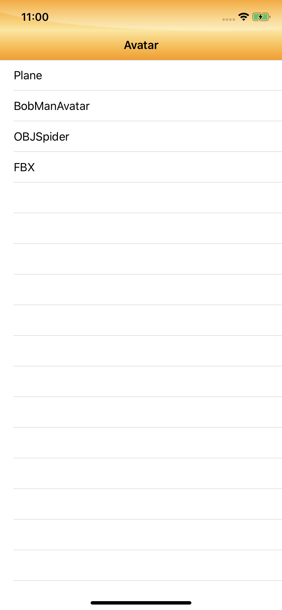
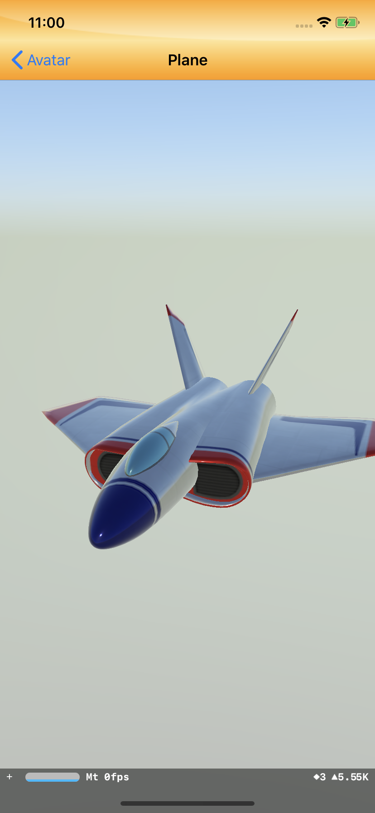
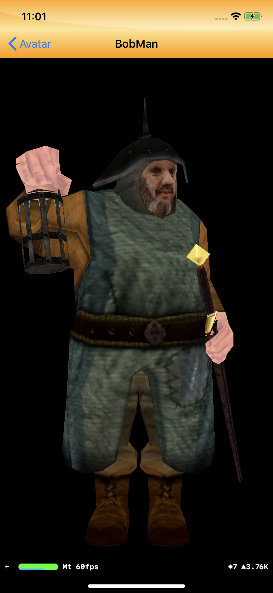
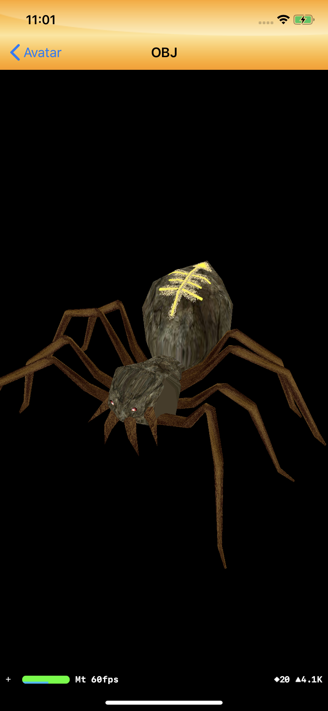
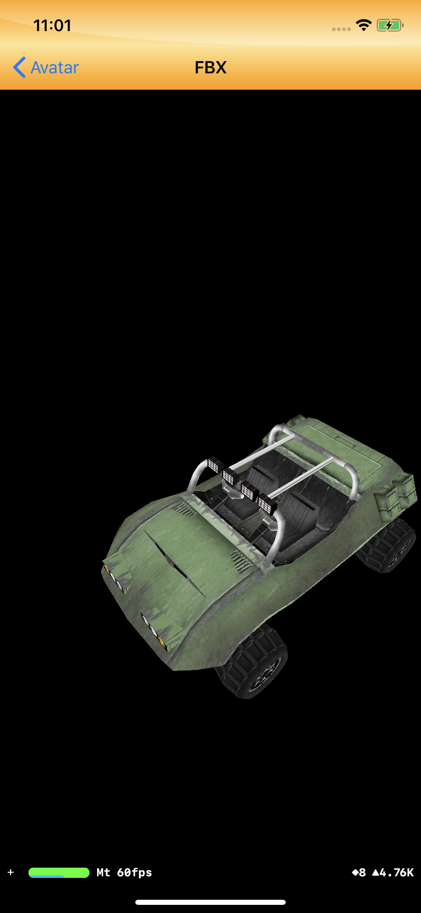

#  利用AssimpKit + iOS SceneKit 显示 3D模型

## 目前测试通过可以显示的模型有 .obj .fbx .md5mesh ，其中.md5mesh 如果有动画文件.md5anim 也可以播放动画.

## 以下是引用的库连接

[assimp](https://github.com/assimp/assimp)
	
[AssimpKit](https://github.com/dmsurti/AssimpKit)

[AssimpKitCarthage-iOSDemo](https://github.com/dmsurti/AssimpKitCarthage-iOSDemo)

## 另外我这边用的AssimpKit源码我已经稍微修改了一下，参考链接是：

[腾讯云](https://cloud.tencent.com/developer/article/1116957)

### 核心代码如下所示:
``` Objective-c
//
//  OBJController.m
//  MGAvatar
//
//  Created by Gaomingyang on 2022/4/21.
//

#import "OBJController.h"
#import <SceneKit/SceneKit.h>
#import <AssimpKit/PostProcessingFlags.h>
#import <AssimpKit/SCNAssimpAnimSettings.h>
#import <AssimpKit/SCNNode+AssimpImport.h>
#import <AssimpKit/SCNScene+AssimpImport.h>

@interface OBJController ()

@end

@implementation OBJController

- (void)viewDidLoad {
    [super viewDidLoad];
    self.title = @"OBJ";
    [self loadOBJ];
}
-(void)loadOBJ{
   
    NSURL *spiderObjUrl = [[NSBundle mainBundle] URLForResource:@"spider" withExtension:@".obj"];
    
    if([[NSFileManager defaultManager] fileExistsAtPath:spiderObjUrl.path]){
        // load mesh
        NSError *error = nil;
        SCNAssimpScene *scene = [SCNScene assimpSceneWithURL:spiderObjUrl postProcessFlags:AssimpKit_JoinIdenticalVertices |
                                 AssimpKit_Process_FlipUVs |
                                 AssimpKit_Process_Triangulate error:&error];
        
        // retrieve the SCNView
        SCNView *scnView = [[SCNView alloc] initWithFrame:CGRectMake(0, 0, self.view.bounds.size.width, self.view.bounds.size.height-84)];
        [self.view addSubview:scnView];
        // set the scene to the view
        scnView.scene = scene.modelScene;
        // allows the user to manipulate the camera
        scnView.allowsCameraControl = YES;
        // show statistics such as fps and timing information
        scnView.showsStatistics = YES;
        // config the view
        scnView.backgroundColor = [UIColor blackColor];
        // play
        scnView.playing = YES;
        
    }else{
        NSLog(@"[ERROR]: Add bob assets via iTunes file sharing");
    }
    
}

@end


```

## 页面如图所示








